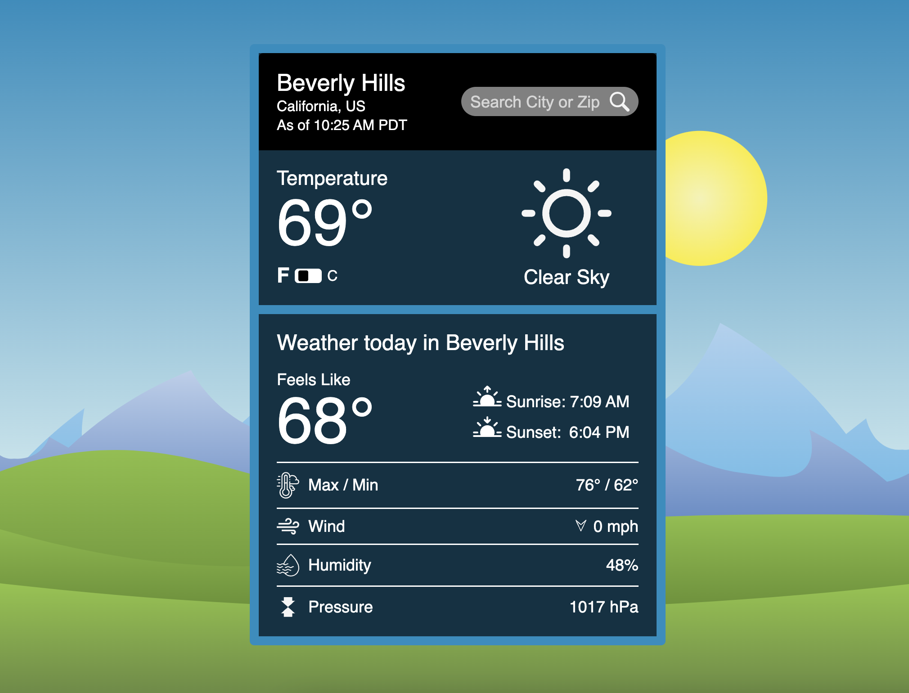

# Weather App

## Overview

A web application detailing current weather conditions for a given location. Weather data provided by OpenWeather current weather data API. Information provided:

- Data collection time
- Current temperature
- Current weather description
- Feels like temperature
- Sunrise time
- Sunset time
- Max/min temperature for area at collection time
- Wind speed and direction
- Humidity
- Pressure

## Usage

To retrieve weather information for your desired location please enter either:

- 5 digit U.S. zip code
- City name
- City name, country alpha-2 code
- City name, state abbreviation, country alpha-2 code

[Live Demo](https://dukdukg00se.github.io/weather-app/)

## Notes

To determine correct timezone the TimeZoneDB RESTful API was used. This occasionally returns a CORS error that eventually resolves itself. If this error occurs the page will display an error and users will have to try again at a later time. I apologize for this and may look into alternatives in the future. Another option would be to use the OpenWeather One Call API, however, this would require adding payment information.

## Learning Objectives

Educational goals when building this application:

- Learn asynchronous JavaScript:
  - Working with APIs
  - Promises
  - Async, Await
- Write clean, modular code

## Helpful Links

- [U.S. state and territory abbreviatons](https://www.faa.gov/air_traffic/publications/atpubs/cnt_html/appendix_a.html)
- [Country codes](https://www.nationsonline.org/oneworld/country_code_list.htm)

## Credits

Page background images from [Pixabay](https://pixabay.com/).

Image authors:

- [M. Maggs](https://pixabay.com/users/wild0ne-920941/?utm_source=link-attribution&utm_medium=referral&utm_campaign=image&utm_content=1844227)
- [Chakkree Chantakad](https://pixabay.com/users/chakkree_chantakad-15107399/?utm_source=link-attribution&utm_medium=referral&utm_campaign=image&utm_content=4821585)
- [Sumit Kumar](https://pixabay.com/users/kinggodarts-20322799/?utm_source=link-attribution&utm_medium=referral&utm_campaign=image&utm_content=6590863)
- [David Munar](https://pixabay.com/users/jdmjallart-13316089/?utm_source=link-attribution&utm_medium=referral&utm_campaign=image&utm_content=6641490)
